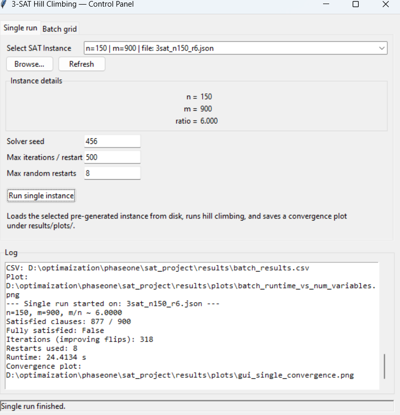
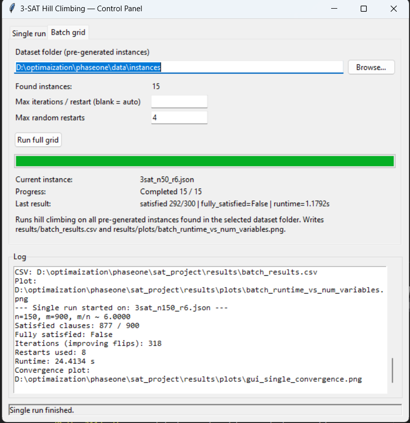
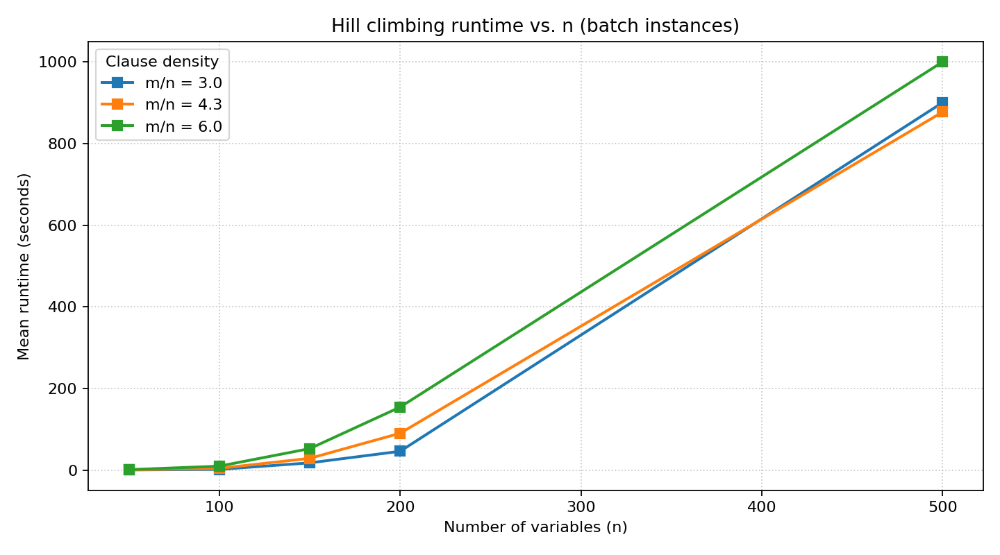
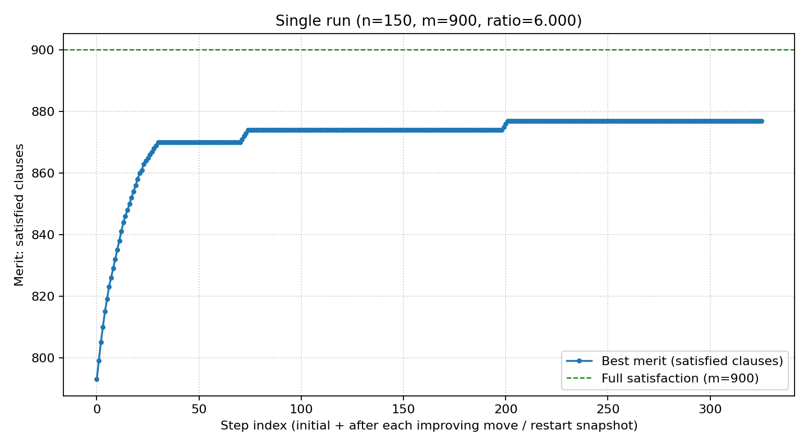

## 3‑SAT Hill Climbing — Desktop Control Panel

This project implements and visualizes a stochastic hill climbing solver with random restarts for 3‑SAT instances. A lightweight Tkinter desktop GUI lets you:

- Run a single pre‑generated SAT instance and plot its convergence.
- Run a full batch over a folder of instances and plot runtime vs. problem size.

All outputs (CSV summaries and plots) are written under `sat_project/results/`.


### What we built

- **Solver**: Greedy hill climbing on the number of satisfied clauses, with **random restarts** and a cap on iterations per restart.
- **GUI**: Two tabs — `Single run` and `Batch grid` — that keep the UI responsive by executing work in background threads.
- **Artifacts**: 
  - Convergence plots for single runs: `sat_project/results/plots/gui_single_convergence.png`
  - Batch runtime plot across instances: `sat_project/results/plots/batch_runtime_vs_num_variables.png`
  - Batch CSV summary: `sat_project/results/batch_results.csv`


### How it works (high level)

- Load a CNF instance (3‑SAT) from JSON (`3sat_*.json`) containing `n`, `m`, and `clauses`.
- Start from a random assignment and iteratively flip the literal that most improves the merit (number of satisfied clauses).
- If no improving flip exists or the iteration budget is exhausted, restart from a new random assignment (up to the configured limit).


### Project layout (key files)

- `sat_project/gui.py` — Tkinter control panel (launch point).
- `sat_project/results/` — All generated CSV files and plots.
- `data/instances/` — Folder you can point the batch tab to (contains `3sat_*.json` files).


### Requirements

- Python 3.10+ on Windows (Tkinter is included with the standard distribution).
- No third‑party dependencies are required.


### How to run

1) Open a terminal in the project root: `D:\optimaization\phaseone`

2) Launch the GUI:

```bash
python .\sat_project\gui.py
```

3) Use the two tabs:

- **Single run**
  - Choose a `3sat_*.json` instance using the dropdown or Browse.
  - Configure `Solver seed`, `Max iterations / restart`, and `Max random restarts`.
  - Click `Run single instance`. The GUI will save a convergence plot to `sat_project/results/plots/gui_single_convergence.png` and log run details (merit, iterations, restarts, runtime).

- **Batch grid**
  - Set `Dataset folder (pre-generated instances)` to a directory containing `3sat_*.json` files (e.g., `D:\optimaization\phaseone\data\instances`).
  - Optionally set `Max iterations / restart` (blank = auto based on n) and `Max random restarts`.
  - Click `Run full grid`. The GUI will:
    - Process all instances in the folder.
    - Write a summary CSV `sat_project/results/batch_results.csv`.
    - Generate `sat_project/results/plots/batch_runtime_vs_num_variables.png`.


### UI screenshots

Single run tab:



Batch grid tab:




### Results and commentary

- **Batch runtime vs. number of variables**

  Image: `sat_project/results/plots/batch_runtime_vs_num_variables.png`

  

  - As the number of variables `n` increases, mean runtime rises steeply, approximately super‑linear for the tested settings.
  - Higher clause density (`m/n`) consistently costs more time because the landscape is tighter and improvements are harder to find.
  - For the same `n`, the order is typically: `m/n = 6.0` (slowest) > `4.3` > `3.0` (fastest).

- **Single run convergence**

  Image: `sat_project/results/plots/gui_single_convergence.png`

  

  - The merit (satisfied clauses) improves rapidly at the beginning, then plateaus as the search reaches a local optimum.
  - Occasional jumps indicate successful restarts that discover a better basin.
  - In the displayed run (`n=150, m=900, ratio=6.0`), the solver reaches 877/900 clauses satisfied — strong but not fully satisfying all clauses. This is typical for challenging, over‑constrained settings.


### Where outputs are saved

- CSV: `sat_project/results/batch_results.csv`
- Batch plot: `sat_project/results/plots/batch_runtime_vs_num_variables.png`
- Single run plot: `sat_project/results/plots/gui_single_convergence.png`


### Reproducing the screenshots (quick guide)

- Single run:
  - Select a `3sat_*.json` instance (e.g., one with `n=150, m=900`).
  - Use `Solver seed = 456`, `Max iterations / restart = 500`, `Max random restarts = 8`.
  - Run and check `sat_project/results/plots/gui_single_convergence.png`.

- Batch run:
  - Point the dataset folder to `D:\optimaization\phaseone\data\instances` (contains 15 instances in the screenshots).
  - Leave `Max iterations / restart` blank to auto‑scale with `n`, and set `Max random restarts = 4–8`.
  - Run and check `sat_project/results/batch_results.csv` and the batch plot under `sat_project/results/plots/`.


### Notes and tips

- If Tkinter fails to start, ensure you are using the standard Python installer for Windows (which includes Tkinter) rather than a minimal distribution.
- The GUI remains responsive during long runs; logs and progress indicators update live.
- You can safely re‑run; new plots and CSVs overwrite previous files with the same names.


### Acknowledgements

This is a teaching/experimentation tool for local search on SAT, designed to provide quick visual feedback on solver behavior under varying problem sizes and clause densities.

